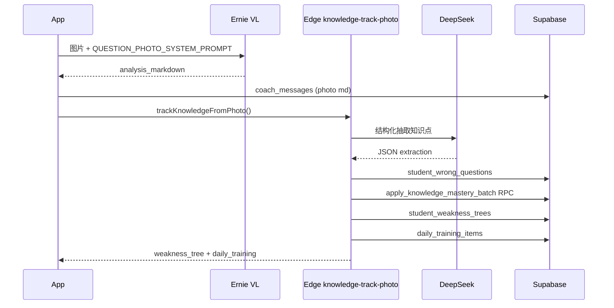

# Sage 学生知识追踪系统

> **栈说明**：本仓库为 Vite + TanStack Router + Supabase Edge Functions。  
> 若迁移到 Next.js，将 `src/lib/knowledge-tracking/api.ts` 的 `supabase.functions.invoke` 替换为  
> `app/api/knowledge/track-photo/route.ts` 转发至同一 Edge Function 即可。

## 数据流（拍照搜题后）



## 表结构

| 表 | 用途 |
|---|---|
| `kg_catalog_nodes` | 全局知识图谱目录（科目→章节→知识点） |
| `knowledge_points` | 用户掌握度（扩展 `mastery_score` 等） |
| `knowledge_mastery_events` | 掌握度变更审计日志 |
| `student_wrong_questions` | 拍照错题库 |
| `student_weakness_trees` | 弱点树物化快照 |
| `daily_training_items` | 每日训练推荐 |

## 掌握度公式

```
score_decayed = prior + (score - prior) × 0.5^(days/14)
score_after   = clamp(score_decayed + event_delta + streak_bonus)
```

| 事件 | Δ |
|---|---|
| photo_wrong | -12 |
| photo_quiz_wrong | -8 |
| photo_quiz_correct | +10 |
| diagnostic_wrong | -18 |
| diagnostic_correct | +15 |
| review_mastered | +20 |

| 分数区间 | 状态 |
|---|---|
| null | 未测试 |
| [0, 30) | 薄弱 |
| [30, 70) | 掌握中 |
| [70, 100] | 已掌握 |

实现：`src/lib/knowledge-tracking/mastery.ts`

## API 路由映射

| Next.js 等价 | 本仓库实现 |
|---|---|
| `POST /api/knowledge/track-photo` | `supabase/functions/knowledge-track-photo` |
| `GET /api/knowledge/weakness-tree` | `fetchStudentWeaknessTree()` |
| `GET /api/knowledge/daily-training` | `fetchDailyTraining()` |

## 客户端接入（Review 拍照完成后）

```typescript
import { trackKnowledgeFromPhoto } from "@/lib/knowledge-tracking";

void trackKnowledgeFromPhoto({
  coach_message_id: assistantRowId,
  subject: "数学",
  session_date: "2026-06-03",
  session_slug: activeSessionSlug,
  analysis_markdown: markdown,
  quiz_results: [{ index: 0, correct: true }],
});
```

## 部署

```bash
supabase db push
supabase functions deploy knowledge-track-photo
```
