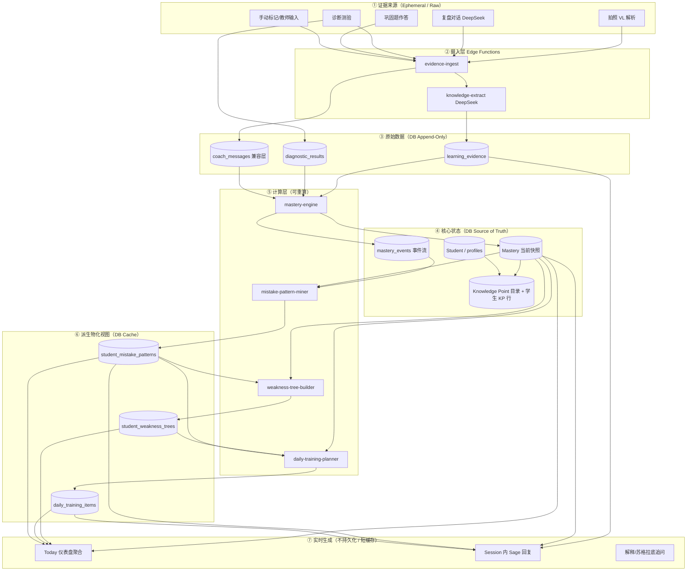
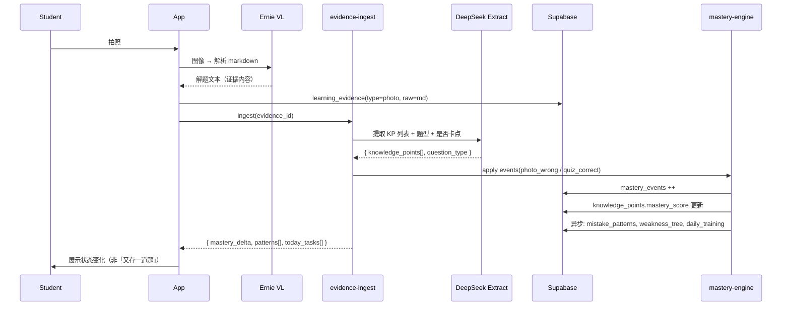

# Sage 系统架构（以学生知识状态为中心）

> **设计原则**：题目 / 拍照 / 聊天内容不是系统核心，只是**观测学生知识状态**的证据来源。  
> 核心循环：`Evidence → State Update → Pattern Detection → Recommendation → Session`

---

## 1. 核心实体与职责

| 实体 | 含义 | 持久化身份 |
|------|------|------------|
| **Student** | 学习者 | `auth.users` + `profiles` |
| **Knowledge Point (KP)** | 可测、可练、可追踪的最小知识单元 | 目录 `kg_catalog_nodes`；学生侧 `knowledge_points` |
| **Mastery** | 某 Student 对某 KP 的掌握状态（数值 + 离散标签 + 时间） | `knowledge_points.mastery_*` + `knowledge_mastery_events` |
| **Mistake Pattern** | 跨多次证据归纳的错误模式（非单次错题） | `student_mistake_patterns`（建议新增） |
| **Learning Session** | 一次连续学习上下文（复盘/拍照/诊断/训练） | `learning_sessions`（建议由 `review_session_slug` 升格） |

**降级为证据层（非核心实体）**：

- 题目文本、图片、聊天记录 → `learning_evidence`（或现有 `coach_messages`）
- 单次对错 → `evidence_outcome` 字段，不单独建「题目表」为中心

---

## 2. 完整数据流图



---

## 3. 单次拍照搜题的状态更新流（实例）



---

## 4. 分类说明

### 4.1 原始数据（Raw / Evidence）

**定义**：外部输入或模型输出的**不可删改事实**，可用于审计与重算。

| 数据 | 示例 | 存储 |
|------|------|------|
| 用户身份与年级 | 高三、目标分 | `profiles` |
| 学习证据 | 拍照 markdown、对话轮次、诊断作答 | `learning_evidence`（新）+ `coach_messages`（过渡） |
| 证据元数据 | 科目、session_id、来源类型、时间 | 证据表字段 |
| 模型抽取 JSON | KP 列表、题型、confidence | `learning_evidence.extraction` jsonb |
| 掌握度变更事件 | photo_wrong, +10 分 | `knowledge_mastery_events` |
| 诊断原始作答 | 对/错 | `diagnostic_results` |

**不视为原始数据**：`mastery_score` 当前值、弱点树 JSON、每日训练列表——这些可由事件重算。

---

### 4.2 计算结果（Computed）

**定义**：由原始数据 + 规则/模型**推导**出的状态或洞察。

| 计算结果 | 输入 | 算法位置 |
|----------|------|----------|
| **Mastery 分数** | events + 时间衰减 | `mastery-engine` / `apply_knowledge_mastery_batch` |
| **Mastery 标签** | 分数区间 → 薄弱/掌握中/已掌握 | `scoreToStatus()` |
| **Mistake Pattern** | 同学科错题聚类 + 题型序列 | `mistake-pattern-miner`（待建） |
| **Weakness Tree** | 全 KP mastery + 目录 parent | `weakness-tree-builder` |
| **Daily Training** | 弱点排序 + 科目配额 + 近因 | `daily-training-planner` |
| **Session Summary** | 对话 transcript | 复盘结束时的 DeepSeek（现有 review summary） |

**Mistake Pattern 示例**（非题目级）：

```text
Pattern: 「圆锥曲线」+「联立后未验判别式」
出现次数: 4 | 最近: 2天前 | 关联 KP: [椭圆与双曲线, 直线与圆锥曲线]
```

---

### 4.3 需要存数据库

| 层级 | 表 | 原因 |
|------|-----|------|
| 身份 | `profiles` | 跨会话配置 |
| 目录 | `kg_catalog_nodes` | 全局 KP 图谱，少变 |
| 状态快照 | `knowledge_points` | 读多写少，UI 列表直接查 |
| 事件流 | `knowledge_mastery_events` | 审计、重算、A/B 调参 |
| 证据 | `learning_evidence` | 法律/产品追溯；重跑抽取 |
| 兼容 | `coach_messages` | 现有聊天 UI；逐步双写 evidence |
| 模式 | `student_mistake_patterns` | 跨题归纳，查询「我总在哪儿错」 |
| 会话 | `learning_sessions` | 聚合 evidence，对应一次复盘 |
| 物化缓存 | `student_weakness_trees`, `daily_training_items` | 避免 Today 页 N+1 重算 |
| 任务完成 | `task_completions` | 用户行为原始事实 |

**不必单独建「题目库表」为中心**；若需要搜题历史，在 `learning_evidence` 加 `question_fingerprint` 去重即可。

---

### 4.4 应该实时生成（不存或短 TTL 缓存）

| 内容 | 原因 | 策略 |
|------|------|------|
| Sage 对话回复 | 强上下文、一次性 | 流式生成，仅存 `coach_messages` 若需历史 |
| 苏格拉底追问 | 依赖当前轮次情绪/表述 | 不存模板 |
| 拍照解题步骤 | 展示型，非状态 | 流式 VL；证据层只存摘要用 extraction |
| 巩固题即时渲染 | UI 层 | 来自 evidence 内 QUIZ 块 |
| Today 页「今日进度」汇总 | 多表 COUNT | React Query 30s stale；或 Redis 60s |
| 弱点树 Drill-down 动画数据 | 纯展示 | 读 `student_weakness_trees` 快照即可 |
| 掌握度**预览**（「若这题错了会 -12」） | 交互反馈 | 客户端 `applyMasteryEvent()` 纯函数 |

**物化 vs 实时边界**：

- **Session 内**：实时（聊天、解析流）
- **跨 Session 仪表盘**：读 DB 快照；快照由事件异步刷新（Edge Function 末尾或 pg_cron）

---

## 5. 逻辑分层（代码模块）

```
src/lib/domain/
  student/           # profiles, grade
  knowledge-point/   # catalog, mapToCatalog
  mastery/           # engine, events, formula
  mistake-pattern/   # cluster, detect
  learning-session/  # session lifecycle
  evidence/          # ingest adapters (photo, chat, diagnostic)

supabase/functions/
  evidence-ingest/       # 统一入口
  mastery-recompute/     # 夜间全量重算（可选）
  knowledge-track-photo/ # 现有，并入 evidence-ingest

src/routes/
  app.today/         # 读 Mastery + DailyTraining + Patterns
  app.review/        # Learning Session UI；写 Evidence
  app.diagnostic/    # Evidence → Mastery
```

---

## 6. 与现有表映射（迁移路径）

| 新模型 | 现有实现 | 迁移动作 |
|--------|----------|----------|
| Student | `profiles` | 保持 |
| Knowledge Point | `kg_catalog_nodes` + `knowledge_points` | 已部分实现 |
| Mastery | `mastery_score`, `knowledge_mastery_events` | 已部分实现 |
| Mistake Pattern | 无 | **新增** `student_mistake_patterns` |
| Learning Session | `review_session_slug` + dates | **升格** `learning_sessions` 表 |
| Evidence | `coach_messages` | **双写** `learning_evidence` |

---

## 7. 设计检验（以知识状态为中心）

| 旧思路（题目中心） | 新思路（状态中心） |
|-------------------|-------------------|
| 存一道题 → 查错题本 | 写一条 evidence → 更新 KP mastery |
| 复盘 = 聊天记录 | 复盘 = Learning Session 产生多条 evidence |
| 弱点 = 某次 summary 文本 | 弱点 = Mastery 分布 + Mistake Pattern |
| Today 任务 = summary 卡片 | Today 任务 = DailyTraining 读 mastery 缺口 |
| 拍照 = 搜题工具 | 拍照 = mastery 观测器 |

---

## 8. 推荐新增 DDL（Mistake Pattern + Session + Evidence）

```sql
-- Learning Session（一次学习单元）
create table learning_sessions (
  id uuid primary key default gen_random_uuid(),
  user_id uuid not null references auth.users(id) on delete cascade,
  subject text not null,
  session_type text not null check (session_type in ('review','photo','diagnostic','training')),
  started_at timestamptz not null default now(),
  ended_at timestamptz,
  legacy_review_session_slug text,  -- 兼容现有 slug
  metadata jsonb not null default '{}'
);

-- 证据（题目内容在此，非核心）
create table learning_evidence (
  id uuid primary key default gen_random_uuid(),
  user_id uuid not null references auth.users(id) on delete cascade,
  session_id uuid references learning_sessions(id) on delete set null,
  evidence_type text not null check (evidence_type in ('photo','chat','diagnostic','quiz')),
  subject text not null,
  raw_content text,
  extraction jsonb not null default '{}',
  linked_knowledge_points text[] not null default '{}',
  created_at timestamptz not null default now()
);

-- 错误模式（计算结果物化）
create table student_mistake_patterns (
  id uuid primary key default gen_random_uuid(),
  user_id uuid not null references auth.users(id) on delete cascade,
  subject text not null,
  pattern_key text not null,
  label text not null,
  description text,
  knowledge_points text[] not null default '{}',
  occurrence_count int not null default 1,
  last_seen_at timestamptz not null default now(),
  unique (user_id, subject, pattern_key)
);
```

---

*文档版本：2026-06-03 · 与 `docs/knowledge-tracking-architecture.md` 互补，后者偏实现细节，本文偏领域架构。*
